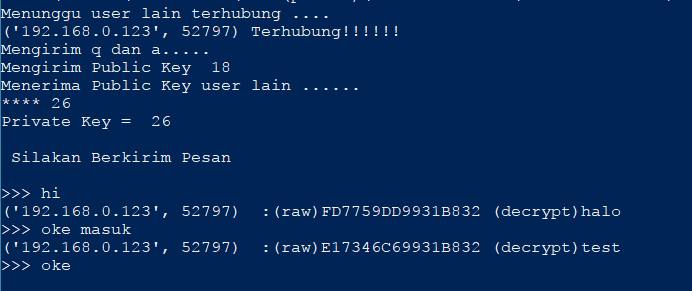

Cara Kerja Protokol Pertukaran Kunci Diffie Hellman

Diffie-Hellman Key Exchange
membangun kunci sesi tanpa menggunakan kunci yang dibagikan sebelumnya. Pesan-pesan yang ditukarkan antara Alice dan Bob bisa dibaca oleh siapapun yang bisa menyadap dan si penyadap tidak akan bisa mengetahui kunci sesi yang akhirnya digunakan oleh Alice dan Bob. 
Di sisi lain, Diffie-Hellman tidak melakukan otentikasi pada pihak-pihak yang terlibat. Salah satu dari kegunaan utama dari DIffie-Hellman adalah dalam protokol Internet Key Exchange(IKE/ Pertukaran Kunci Internet), sebuah bagian pusat dari arsitektur IP Security(IPsec).

Protokol Diffie-Hellman mempunyai dua parameter, q dan a, yang mana keduanya bersifat publik dan mungkin akan digunakan oleh semua user dalam sistem tertentu. 
Parameter q harus berupa bilangan prima. Bilangan-bilangan bulat mod q (singkatan dari modulo q) mempunyai jangkauan dari 0 hingga q-1, karena x mod q adalah sisa dari x dibagi q, dan membentuk apa yang para matematikawan sebut sebagai group dibawah perkalian. 
Parameter a (biasanya disebut sebuah generator) harus berupa sebuah akar primitive(primitive root) dari q: untuk setiap angka n dari 1 sampai q -1 pasti ada nilai k sehingga n = a^k mod q. sebagai contoh jika q adalah bilangan prima 5 (pada sistem yang sebenarnya akan digunakan angka yang jauh lebih besar), maka kita akan memilih 2 sebagai generator karena:
1 = 2^0 mod q
2 = 2^1 mod q
3 = 2^3 mod q
4 = 2^2 mod q
Misalkan Alice dan Bob ingin sepakat pada sebuah kunci simetris yang terbagi. Alice dan Bob dan orang lain sudah mengetahui nilai p dan g. Alice meng-generate sebuah nilai privat acak a dan Bob meng-generate sebuah nilai acak privat b. baik a dan b diambil dari sekumpulan integer {1,….,p-1}. Alice dan Bob menurunkan pasangan nilai publik mereka, nilai yang akan mereka kirimkan satu sama lain tanpa terenkripsi, sebagai berikut. Nilai publik dari Alice adalah
a^xA mod q
dan nilai publik Bob adalah
a^xB mod q
Kemudian mereka menukar nilai pubik mereka. Akhirnya, Alice menghitung
a^xAB mod q = (a^xB mod q)^xA mod q
dan bob menghitung
a^xBA mod q = (a^xA mod q)^xB mod q
Alice dan Bob sekarang mempunyai kAB mod q = a^XBA mod q sebagai kunci simetris mereka yang dibagikan satu sama lain.

https://github.com/nuruliik/KIJ-F02/edit/master/diffie-hellman/
https://github.com/nuruliik/KIJ-F02/edit/master/diffie-hellman/Capture.png

Referensi
http://kuliah-hhn.blogspot.co.id/2012/05/cara-kerja-protokol-pertukaran-kunci.html
PPT Pak Tohari Diffie-Hellman Key Exchange
