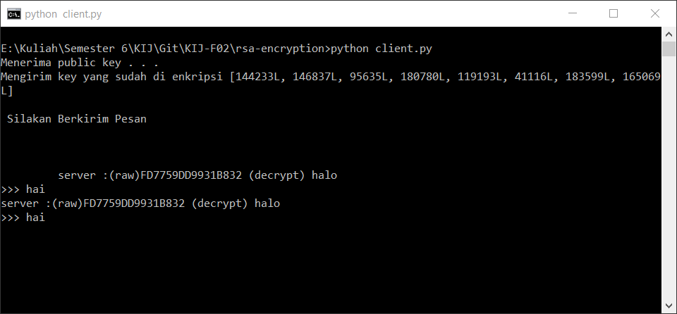
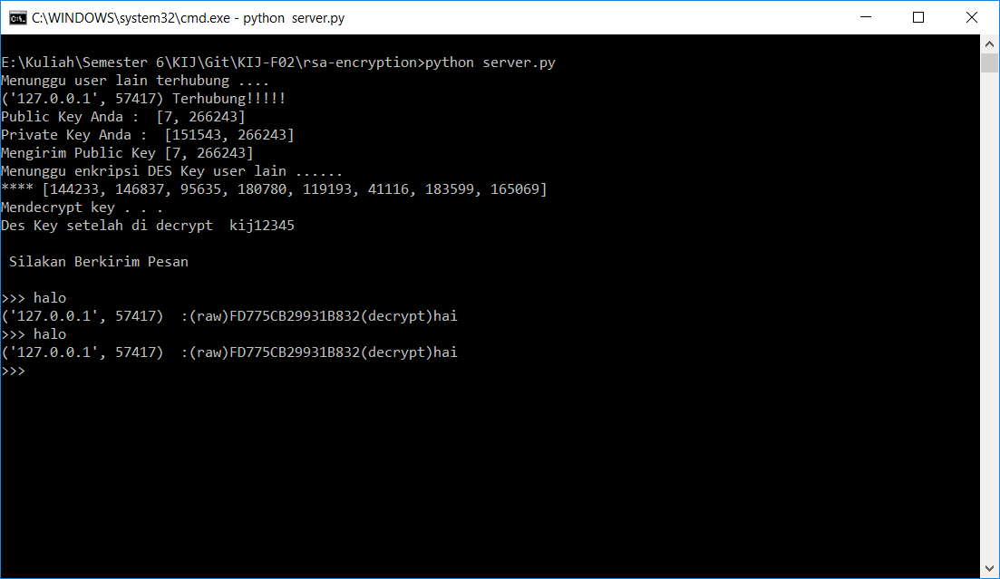

Enkripsi dan Dekripsi Menggunakan RSA

KIJ F Kelompok F02

1. I Made Fandy Aditya Wirana (5114100026)
2. Nurul Wachidah (5114100052)

RSA Cipher atau kriptografi kunci publik merupakan salah satu kriptografi asimetris, dimana kunci untuk melakukan enkripsi dan dekripsi berbeda. Nama RSA diambil dari inisial orang yang menciptakannya yaitu Ron Rivest, Adi Shamir, dan Leonard Adleman, dan dipublikasikan pada jurnal ilmiah Communication of ACM tahun 1977. Kekuatan utama dari RSA adalah kesulitan dalam memfaktorkan bilangan yang besar (NP Hard Problem), sehingga dapat dimanfaatkan untuk mengamankan data.

Langkah-langkah dalam mengenkripsi atau mengdekripsi RSA adalah sebagai berikut :

1. Pilih 2 buah bilangan prima p dan q.
2. Hitung nilai n = p * q , (usahakan agar setidaknya n > 255 agar dapat mewakili seluruh karakter ASCII).
3. Hitung nilai m = (p-1) * (q-1).
4. Cari nilai e , dimana e merupakan relatif prima dari m.
5. Cari nilai d , yang memenuhi persamaan ed ≡ 1 mod m atau d = e-1 mod m.
6. Kunci public (e , n) dan kunci private (d , n).
7. Fungsi enkripsi → E (ta)=tae mod n ; dimana ta merupakan karakter ke-a dari message (pesan) yang akan dienkripsi.
8. Fungsi dekripsi → D (ca)=cad mod n ; dimana ca merupakan karakter ke-a dari ciphertext yang akan didekripsikan.

Contoh kasus, misalnya terdapat dua orang, Andi yang ingin mengirimkan pesan kepada Budi, maka komputer Andi akan memberitahukan kepada komputer Budi untuk membuat kunci publik dan kunci private (kunci dibuat oleh orang yang akan menerima pesan, sehingga kunci private tidak akan pernah meninggalkan komputer penerima, sedangkan kunci publik akan dikirimkan kepada komputer pengirim pesan, dimana kunci publik hanya bisa digunakan untuk meng- enkripsi pesan).

 Komputer Budi akan melakukan langkah-langkah berikut :
 1. Men- generate bilangan prima p = 59 dan q = 67.
 2. Menghitung nilai n = 59 * 67 = 3953.
 3. Menghitung nilai m = (59-1) * (67-1) = 3828.
 4. Mencari nilai e yang relatif prima terhadap m. (*Nilai e merupakan sembarang bilangan dimana FPB(e,m) = 1, komputer dapat men- generate bilangan acak kemudian menggunakan algoritma euclidean untuk membuktikannya, atau (menurut penulis) agar lebih cepat, komputer Budi dapat memilih sembarang bilangan Prima e dimana e > 2 dan m mod e ≠ 0.)
 5. Pada langkah berikutnya, akan dicari nilai d dimana ed ≡ 1 (mod m) atau d=e-1 mod m (*Untuk mencari nilai d, dapat menggunakan extended euclidean algorithm)
 6. Langkah selanjutnya adalah menentukan kunci publik dan kunci private. Kunci private tetap berada dikomputer Budi, namun kunci publik dikirimkan ke komputer Andi, dimana komputer Andi akan menggunakan kunci publik untuk meng-enkripsi pesan yang akan dikirimkan ke komputer Budi.
 7. Langkah selanjutnya komputer Andi akan mengenkripsi pesan yaitu : "GO" maka komputer Andi perlu mengetahui kode ASCII karakter "G" dan "O" yaitu : 71 dan 79 , kemudian melakukan enkripsi dengan fungsi enkripsi → E(ta)=tae mod n
 8. Langkah terakhir komputer Budi akan mendekripsi ciphertext c1=1798 dan c2=2444 dengan fungsi dekripsi → D(ca)=cad mod n
 
 Dokumentasi
 
 Client
 
 
 
 Server
 
 
 
 Referensi :
 
 Rosen, K. H. 1986. Elementary Number Theory and Its Applications. Addison-Wesley Publishing Company: USA
 Schneier, B. 1995. Applied cryptography (2nd ed.): protocols, algorithms, and source code in C. John Wiley & Sons, Inc:New York, NY, USA
 http://stackoverflow.com/questions/4422633/rsa-private-key-calculation-with-extended-euclidean-algorithm
 http://www.webkeren.net/2015/03/cara-membuat-spoiler-di-blog-blogger-blogspot.html
 https://en.wikipedia.org/wiki/RSA_(cryptosystem)
 http://kur2003.if.itb.ac.id/file/Teori%20Bilangan%20Bulat.doc
 http://octarapribadi.blogspot.co.id/2016/02/enkripsi-dan-dekripsi-menggunakan-rsa.html
